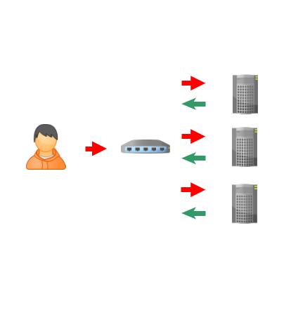
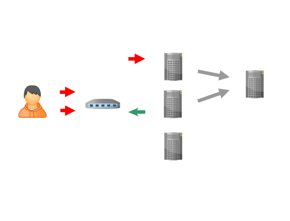

# 不再重要的代码热升级

## 背景

今天在某个微信群里看到有人询问 docker stop 相关的问题——
> Q: 问一下大伙，容器 stop 的时候，是直接 stop ，还是内部业务处理完之后再stop？

问题很简单，做试验就知道，缺省情况下，docker daemon会先发送一个SIGTERM，如果容器进程没有正常关闭，daemon将在10秒后发送SIGKILL强制关闭容器进程。

大家在群里聊了几句，然后发现这个问题来自应用代码热升级的场景——
> Q: 可以继续处理业务吗？比如容器代码更新，更新瞬间还有业务没完成...
> Q: 在物理机时代热部署，可以zero down，但是容器我就不知道是否能应对这个了

这就有意思了，问题很有代表性，于是我参与讨论了一番，总结成这篇文章。

## 热升级是伪需求

首先下定义，我这里说的代码热升级，特指一些语言的运行时代码更新技术，比如java基于 classloader 动态更新jar的技术，以及erlang的模块热更新。

代码热升级技术曾经非常有用，而且很酷。它一出现就吸引了不少人的注意，直到今天也有很多人热衷。但是，在云和容器的时代，这个价值已经变得不再重要了。

因为用户真正的需求是系统**始终可用**（避免中断访问），而我们只要依次关闭并升级容器进程，保持整个集群对用户可用就行了。

具体来说，当我们需要应用更新时，容器管理系统应当对容器进行依次（或者分批次）陆续执行 docker stop 操作，然后更新镜像并重新启动。相应的，docker 容器进程需要正确做好对信号量的处理，比如在收到SIGTERM的时候尽快做好清理工作，避免强制关闭。

实际上，两步kill的做法并非docker独有，信号量这种机制就是为了对进程进行管控，因此各种进程管理工具都是这么做的（假如你的公司有自建的平台，在管理进程时没有运用这种方式，那么板子应该打在平台设计者这里）。

## 异步化

有人会觉得，上面这个做法过于理想化，毕竟已经接入的连接需要继续服务到结束，如果业务复杂，不能在10s内结束，又怎么办？

答案是异步化，以http服务为例，如下图所示。

通常的交互是这样的——

显然，每次用户的http请求都被阻塞住，一旦服务器更新这样的风吹草动，用户后续操作的可靠性保证将变得极其复杂。

于是我们改为这样——

这时，用户的请求进入web application以后被尽快处理，需要长时处理的业务交给后台异步处理。

## 长时还是短时？

异步化在理论上很容易，但是，为了做好异步化这件事，我们需要精心分析理解业务需求，区分长时任务和短时任务，或者说，学会从长时任务中发现短时任务。

