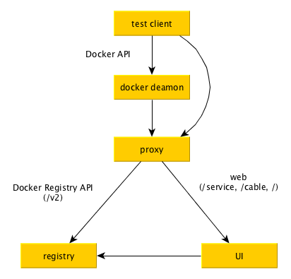

# Docker Registry 测试遇到的问题

今天对shelter(一个私有registry管理系统)进行测试的时候遇到了问题。
测试环境大概是这样：



之前的测试中，测试客户端运行在宿主机上，其它节点则使用 docker 容器运行，只是把proxy的端口进行了映射，这样工作一直是没问题的。但是等到我编写完毕以后把测试代码也放入容器，测试却失败了：

```
test_1      | # language: zh-CN
test_1      | 功能: 用户组权限下的镜像存取
test_1      | 
test_1      |   场景: 用户组以外的用户不能执行镜像操作 # features/image-group.feature:3
......
test_1      |     那么不可以在g1中添加镜像      # features/step_definitions/image_steps.rb:8
test_1      |       invalid reference format
test_1      |        (Docker::Error::ServerError)

```

经过检查发现是测试代码调用 docker push 命令的时候出现错误，初步怀疑是 docker daemon 没有设置好 insecure registry ，导致不能连接 registry 。

为了验证这个猜测，独立运行一下 docker daemon 容器（我是基于 dind 运行的）

```
# docker run --name dind -it --rm --privileged docker:dind --insecure-registry 10.203.10.28
```

然后尝试 docker exec 进去看看情况，在另一个终端下执行

```
# docker exec -it dind /bin/sh
/ # docker info
...
Insecure Registries:
 10.203.10.28
 127.0.0.0/8

```

发现设置是有效的，感到很奇怪，于是继续实验

```
/ # docker login 10.203.10.28
Username: admin
Password: 
Error response from daemon: Get http://10.203.10.28/v2/: Get http://localhost/service/token?account=admin&client_id=docker&offline_token=true&service=token-service: dial tcp [::1]:80: getsockopt: connection refused
```

果然还是不行，不过这次发现了一个细节：
```
Get http://localhost/service/token
```

这句localhost很奇怪，翻出 registry 的日志看，也是如此：

```
... /v1.24/auth returned error: ... Get http://localhost/service/token...connection refused

```

于是才明白，这个错误是因为 registry 把 auth 请求发给了 localhost ，而这个设置在这里：

```
# docker-compose.yml
services:
  registry:
    image: library/registry:2.4.0
    volumes:
      - ../config/registry/:/etc/registry/
    command:
      ["serve", "/etc/registry/config.yml"]
  proxy:
    ...
  ui:
    ...
```

问题出在 config.yml 文件的内容上

```
# config.yml
auth:
  token:
    issuer: registry-token-issuer
    realm: http://localhost/service/token
```

实际上，这里的localhost是之前本机测试时指定的，现在全部容器化以后就不再适用了。

修改起来很简单，用新的地址即可，更进一步，我们可以直接使用机器名 proxy (参见上面 docker-compose.yml 文件)，这个是 compose 环境中容器互操作时可以使用的方法。

然而问题并没有结束，修改 compose 文件后发现还是有问题的，主要是机器名访问的问题：

```
# registry/config.yml
realm: http://proxy/service/token
# docker-compose.yml
  proxy:
    image: nginx:1.9
    ......
```
这种情况下，docker login proxy会成功，然而docker push proxy/library/hello 会失败，这是由于docker的镜像地址格式一开始没有定好带来的麻烦。

```
docker image的格式是 domain_or_host/namespace/repository:tag ，其中唯一不能省略的是 repository ，而且允许私有 registry 的镜像没有 namespace 。

这样导致一个问题，docker daemon 在 push 的时候，对于`/`前面的那部分内容， 无法判断是 namespace 还是 domain_or_host ，最后的解决办法是一个比较丑陋的方式：
1. 判断是否含有句点`.`，比如： `myhost.local`，或者`192.168.0.11`
2. 判断是否以端口结尾，比如：`myregistry:5000`

显然，如果我们的私有registry是 `proxy` ，那么它就会被识别为 namespace ，然后——就 push 到官方 registry 了。
```

解决的办法是让 proxy 装成一个域名，比如 ` proxy.local `:

```
  dind:
    ...
    command: "--insecure-registry proxy.local"
    links:
      - proxy:proxy.local
    ...
```
